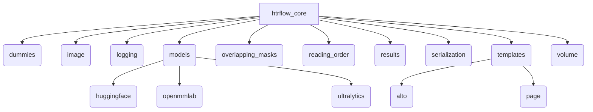
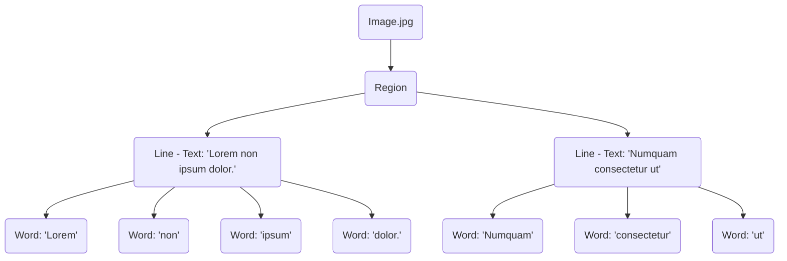

# Htrflow Design

# Sequence Diagram workflow

The Swedish National Archives introduces a...

Lorem ipsum dolor sit amet, consectetur adipiscing elit, sed do eiusmod tempor incididunt ut labore et dolore magna aliqua. Ut enim ad minim veniam, quis nostrud exercitation ullamco laboris nisi ut aliquip ex ea commodo.

# Data strucutre

