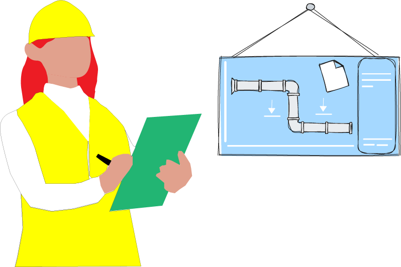

# Pipeline

Welcome to the HTRflow Pipeline documentation. This section introduces the modular pipeline framework designed to process handwritten text images using customizable "pipeline" steps. You can define your pipelines using `YAML` configuration files or `Python` code.

## Pipeline Guide

This guide provides an overview of the pipeline architecture, explains some of the available steps, and shows you how to configure and run your pipelines for handwritten text recognition tasks.

<figure markdown="span" align="center">

<figcaption></figcaption>
</figure>


The following images illustrate how YAML pipeline templates function. The example below serves as a template for common document types such as letters, notes, and individual pages.

```yaml title="pipeline.yaml"
steps:
- step: Segmentation
  settings:
    model: yolo
    model_settings:
      model: Riksarkivet/yolov9-lines-within-regions-1
- step: TextRecognition
  settings:
    model: TrOCR
    model_settings:
      model: Riksarkivet/trocr-base-handwritten-hist-swe-2
- step: OrderLines
```

!!! tip
    See [Example Pipeline](#example-pipelines) for inspiration of templates.

### Understanding YAML Pipeline Templates

Each template is designed for specific document types – the example below shows a template optimized for single-column running text, such as letters, notes, and individual pages.

<figure markdown="span" align="center">

<figcaption>Template chosen based on the material (a letter)</figcaption>
</figure>

### Pipeline Steps

Each pipeline consists of sequential steps executed from top to bottom. In this example, we focus on two primary steps:

1. **Segmentation**: Identifies and extracts text lines from the image.
2. **Text Recognition**: Performs Handwritten Text Recognition (HTR) on the segmented lines.

<figure markdown="span" align="center">

<figcaption>Instance segmentation (polygons) for the HTR step</figcaption>
</figure>

### Model Integration

Models specified in the pipeline can be downloaded directly from the [Huggingface model hub](https://huggingface.co/models?library=htrflow). For a comprehensive list of supported models, refer to the [HTRflow Models Documentation](https://ai-riksarkivet.github.io/htrflow/latest/getting_started/models.html#models).

> **Note**: For English text recognition, you'll need to specify an appropriate model ID, such as the [Microsoft TrOCR base handwritten model](https://huggingface.co/microsoft/trocr-base-handwritten).

<figure markdown="span" align="center">

<figcaption>Both models IDs are from Riksarkivet</figcaption>
</figure>

### Processing Workflow

These steps illustrate how an input image is transformed into recognized text through a series of targeted operations. Each step is designed to progressively refine the data, ensuring that the final output is both accurate and well-organized.

#### Text Line Detection
The first step is to identify and extract individual text lines from the input image. In this phase, a dedicated model detects the boundaries of each text line, segmenting the image into smaller, manageable parts.


<figure markdown="span" align="center">

<figcaption>Illustrates the text line segmentation process</figcaption>
</figure>

#### Text Recognition
Once the text lines have been isolated, they are forwarded to the Handwritten Text Recognition (HTR) component. This stage involves decoding the visual patterns into machine-readable text. The HTR model is specifically optimized for interpreting handwritten text, ensuring that even challenging scripts are transcribed accurately.

<figure markdown="span" align="center">

<figcaption> This TrOCR is a fine-tuned HTR-model specifacally for historical Swedish text</figcaption>
</figure>


#### Reading Order Determination

After the text has been recognized, the final step is to arrange the text lines in the correct reading order. This is crucial when dealing with documents that may have complex or non-linear layouts. In this example, a simple top-down ordering transformation is applied, ensuring that the extracted text flows naturally from one line to the next.


<figure markdown="span" align="center">

<figcaption>A simple top-down ordering transformation of the HTR output</figcaption>
</figure>

There are additional steps available, and you can also configure your own custom steps. See [Pipeline steps](#pipeline-steps) for more details.

## Pipeline steps

HTRflow pipelines operate on [`Collection`](document_model.md) instances. A `Collection` represents one or several input images. Each pipeline step takes a `Collection` and returns an updated `Collection`. Here is a toy example of a pipeline step in python:


```python
class ExampleStep(PipelineStep):
    def run(self, collection: Collection) -> Collection:
        for page in collection:
            # Do something
        return collection
```

The step is based on `PipelineStep`, which is the common base class of all pipeline steps. It is defined by overriding the `run` method.

A pipeline step may take arguments at initialization time. Here is an example pipeline step with a `value` argument:
```python
class ExampleStepWithArgument(PipelineStep):

    def __init__(self, value):
        self.value = value

    def run(self, collection: Collection) -> Collection:
        for page in collection:
            if self.value:
                # Do something
        return collection
```

!!! tip
    See [Reference](../reference/pipeline-steps.md) for a list of all predefined pipeline steps.

## Defining a pipeline
A pipeline is a sequence of pipeline steps. HTRflow offers two ways of defining pipelines: As YAML files or in Python code.


### YAML
YAML pipelines are used with HTRflow's CLI and offers a no-code interface to HTRflow. Here is a one-step YAML pipeline that would run `ExampleStep()`:
```yaml title="pipeline.yaml"
steps:
- step: ExampleStep
```

Arguments can be passed to steps by adding `settings`. Any key-value pairs under `settings` are forwarded to the step's constructor. This pipeline would run `ExampleStep()` followed by `ExampleStepWithArgument(value=0.5)`:
```yaml title="pipeline.yaml"
steps:
- step: ExampleStep
- step: ExampleStepWithArgument
  settings:
    value: 0.5
```

Use the `htrflow pipeline` command to run a YAML pipeline:

```bash
htrflow pipeline path/to/pipeline.yaml path/to/inputs
```

The `path/to/inputs` should point to a single image (for example, `images/image0.jpg`) or a directory of images (for example, `images`).

### Python

Pipelines can also be defined directly in python code. The above pipeline is equivalent to this code snippet:
```python
from htrflow.pipeline import Pipeline
from htrflow.volume import Collection

collection = Collection.from_directory("path/to/inputs")

pipeline = Pipeline(
    [
        ExampleStep(),
        ExampleStepWithArgument(value=0.5)
    ]
)

pipeline.run(collection)
```


### Loading YAML Files with python

You can easily define and execute your pipelines by loading a YAML configuration file with the HTRflow package. This allows you to quickly modify your pipeline settings without changing your code.

Below is an example demonstrating how to load a YAML configuration from a string (or file), create a pipeline, and run it on your input images:

```python
from htrflow.pipeline.pipeline import Pipeline
from htrflow.volume.volume import Collection
from htrflow.pipeline.steps import auto_import
import yaml

# Define the YAML configuration as a string.
my_yaml = """
steps:
- step: Segmentation
  settings:
    model: yolo
    model_settings:
      model: Riksarkivet/yolov9-lines-within-regions-1
- step: TextRecognition
  settings:
    model: TrOCR
    model_settings:
      model: Riksarkivet/trocr-base-handwritten-hist-swe-2
- step: OrderLines
- step: Export
  settings:
    format: txt
    dest: outputs
"""

# Load the YAML configuration.
config = yaml.safe_load(my_yaml)

# Specify your images path or folder.
images = ['./my_image.jpg']

# Create a pipeline instance from the loaded configuration.
pipe = Pipeline.from_config(config)

collection = Collection(images)
# Run pipeline
collection = pipe.run(collection)
print(collection)

```

In this example:

- **YAML Configuration:** The `my_yaml` string defines a pipeline with four steps: **Segmentation**, **TextRecognition**, **OrderLines**, and **Export**.
- **Loading YAML:** The configuration is loaded using `yaml.safe_load(my_yaml)`.
- **Pipeline Creation:** A pipeline is created using `Pipeline.from_config(config)`.
- **Image Importing:** `Collection` can take list of image paths.
- **Pipeline Execution:** The pipeline is run on each collection, and the final output is printed.

This method enables you to experiment with different pipeline configurations effortlessly by simply modifying the YAML file.


## Example pipelines

### Simple layout
Letters, notes, single pages, and other single-column running text only need one `Segmentation` step. This pipeline uses a `Segmentation` step with the `Riksarkivet/yolov9-lines-within-regions-1` model to find lines to transcribe. Those lines are then transcribed by a `TextRecognition` step, ordered by `OrderLines` and finally exported as plain text.

```yaml title="pipeline.yaml"
steps:
- step: Segmentation
  settings:
    model: yolo
    model_settings:
      model: Riksarkivet/yolov9-lines-within-regions-1
- step: TextRecognition
  settings:
    model: TrOCR
    model_settings:
      model: Riksarkivet/trocr-base-handwritten-hist-swe-2
- step: OrderLines
- step: Export
  settings:
    format: txt
    dest: outputs
```

Example output from segmentation step:

<figure markdown="span">
{: style="height:400px;" }
<figcaption>A letter dated 1882. <a href="https://sok.riksarkivet.se/bildvisning/Brev_451511_1512_01">Source</a>. </figcaption>
</figure>


### Nested segmentation
Segmentation steps can be chained to create a nested segmentation. In this pipeline, the first `Segmentation` step uses a model that segments the page into regions. Those regions are then segmented into lines by another model in the next `Segmentation` step. Inference steps such as `Segmentation` and `TextRecognition` always works on the leaf nodes of the [document tree](document_model.md), so the `TextRecognition` step will only transcribe the line images, and not the regions. This pipeline uses two `Export` steps to export the results as both plain text and Alto XML.

```yaml title="pipeline.yaml"
steps:
- step: Segmentation
  settings:
    model: yolo
    model_settings:
       model: Riksarkivet/yolov9-regions-1
- step: Segmentation
  settings:
    model: yolo
    model_settings:
      model: Riksarkivet/yolov9-lines-within-regions-1
- step: TextRecognition
  settings:
    model: TrOCR
    model_settings:
      model: Riksarkivet/trocr-base-handwritten-hist-swe-2
- step: ReadingOrderMarginalia
- step: Export
  settings:
    format: txt
    dest: text-outputs
- step: Export
  settings:
    format: alto
    dest: alto-outputs
```

Example output from multiple (nested) segmentation steps:

<figure markdown="span">
{: style="height:400px;" }
<figcaption>A page from Bergskollegium dated 1698. <a href="https://sok.riksarkivet.se/bildvisning/40004028_00007">Source</a>. </figcaption>
</figure>


## Example snippets
This section provides some example snippets that can be pasted into an existing pipeline. For more details and pipeline steps, read the [Pipeline steps reference](../reference/pipeline-steps.md).

### Generation configuration
A model's generation settings can be controlled by including `generation_settings`. Different models support different arguments here. For example, `transformers`-based models such as `TrOCR` accept the same arguments as `model.generate()`. Check the [Model reference](../reference/models.md) for details about each model. Here, we set `num_beams=4` to use beam search instead of greedy decoding.

```yaml
- step: TextRecognition
  settings:
    model: TrOCR
    model_settings:
       model: Riksarkivet/trocr-base-handwritten-hist-swe-2
    generation_settings:
       num_beams: 4
```

### Multiple output formats
Chain `Export` steps to export results to different formats.

```yaml
- step: Export
  settings:
    format: txt
    dest: outputs
- step: Export
  settings:
    format: json
    dest: outputs
```

### Export partial results
An `Export` step can be placed within a pipeline to export partial results. Here, an `Export` step is used to export the raw results before post-processing, and another `Export` step exports the results after post-processing.
```yaml
- step: Export
  settings:
    format: txt
    dest: raw-outputs
- step: RemoveLowTextConfidenceLines
  settings:
    threshold: 0.95
- step: Export
  settings:
    format: txt
    dest: cleaned-outputs
```
