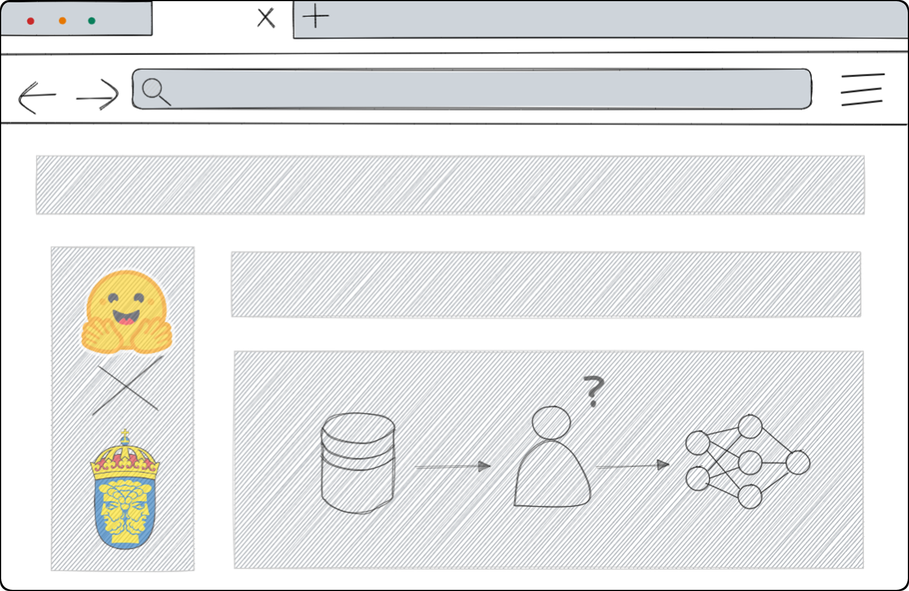

    
    
    
    
    

___

!!! Warning "Docs: Work in progress!"

    [Htrflow](https://pypi.org/project/htrflow/) has a stable release, but the docs is still under development.

## Htrflow

<!-- { align=right width="300" } -->

AIRA, the AI-lab at Riksarkivet (The Swedish National Archives), presents **Htrflow** !

An open-source framework designed to enhance productivity and flexibility for both Handwritten Text Recognition (HTR) and Optical Character Recogntion (OCR). It is easy to learn, delivers high performance, and is ready for seamless integration and scaling in production environments.

<!--  -->

## Key features
- **Standardization**: Avoid reinventing the wheel by standardizing HTR and OCR processes.
- **Intuitive Design**: User-friendly and intuitive interface. 
- **Collaboration**: Facilitate seamless collaboration both internally and with external partners within the humanities space.
- **Modular Design**: Employ the "Lego principle" to create building blocks for specific document types using “blueprints.”
- **Ease of Learning**: Simple and intuitive design that is easy to learn.
- **Robustness**: Production-ready code that has been thoroughly tested.
- **Standards-Based**: Supports various industry standard formats such as XML and JSON (and more).
___

## Ecosystem (WIP)

=== "Htrflow as a Service (WIP)"

    Cloud Native support

    

    
    

=== "Htrflow Sandbox (WIP)"

    GUI, developed in Svelte and Gradio (WIP)

    

    
    

