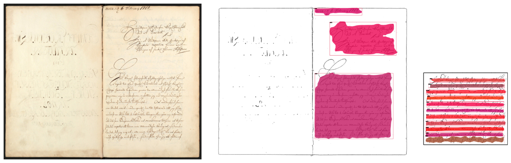

# Pipeline

## Pipeline steps
HTRflow pipelines operate on [`Collection`](document_model.md) instances. A `Collection` represents one or several input images. Each pipeline step takes a `Collection` and returns an updated `Collection`. Here is a toy example of a pipeline step:

```python
class ExampleStep(PipelineStep):
    def run(self, collection: Collection) -> Collection:
        for page in collection:
            # Do something
        return collection
```

The step is based on `PipelineStep`, which is the common base class of all pipeline steps. It is defined by overriding the `run` method.

A pipeline step may take arguments at initialization time. Here is an example pipeline step with a `value` argument:
```python
class ExampleStepWithArgument(PipelineStep):

    def __init__(self, value):
        self.value = value

    def run(self, collection: Collection) -> Collection:
        for page in collection:
            if self.value:
                # Do something
        return collection
```

!!! tip
    See [Reference](../reference/pipeline-steps.md) for a list of all predefined pipeline steps.

## Defining a pipeline
A pipeline is a sequence of pipeline steps. HTRflow offers two ways of defining pipelines: As YAML files or in Python code.


### YAML
YAML pipelines are used with HTRflow's CLI and offers a no-code interface to HTRflow. Here is a one-step YAML pipeline that would run `ExampleStep()`:
```yaml title="pipeline.yaml"
steps:
- step: ExampleStep
```

Arguments can be passed to steps by adding `settings`. Any key-value pairs under `settings` are forwarded to the step's constructor. This pipeline would run `ExampleStep()` followed by `ExampleStepWithArgument(value=0.5)`:
```yaml title="pipeline.yaml"
steps:
- step: ExampleStep
- step: ExampleStepWithArgument
  settings:
    value: 0.5
```

Use the `htrflow pipeline` command to run a YAML pipeline:
```bash
htrflow pipeline path/to/pipeline.yaml path/to/inputs
```
The `path/to/inputs` should point to a single image (for example, `images/image0.jpg`) or a directory of images (for example, `images`).

### Python
Pipelines can also be defined directly in Pyhton code. The above pipeline is equivalent to this code snippet:
```python
from htrflow.pipeline import Pipeline
from htrflow.volume import Collection

collection = Collection.from_directory("path/to/inputs")

pipeline = Pipeline(
    [
        ExampleStep(),
        ExampleStepWithArgument(value=0.5)
    ]
)

pipeline.run(collection)
```


## Example pipelines

### Simple layout
Letters, notes, single pages, and other single-column running text only need one `Segmentation` step. This pipeline uses a `Segmentation` step with the `Riksarkivet/yolov9-lines-within-regions-1` model to find lines to transcribe. Those lines are then transcribed by a `TextRecognition` step, ordered by `OrderLines` and finally exported as plain text.

```yaml title="pipeline.yaml"
steps:
- step: Segmentation
  settings:
    model: yolo
    model_settings:
      model: Riksarkivet/yolov9-lines-within-regions-1
- step: TextRecognition
  settings:
    model: TrOCR
    model_settings:
      model: Riksarkivet/trocr-base-handwritten-hist-swe-2
- step: OrderLines
- step: Export
  settings:
    format: txt
    dest: outputs
```

Example output from segmentation step:

<figure markdown="span">
{: style="height:400px;" }
<figcaption>A letter dated 1882. <a href="https://sok.riksarkivet.se/bildvisning/Brev_451511_1512_01">Source</a>. </figcaption>
</figure>


### Nested segmentation
Segmentation steps can be chained to create a nested segmentation. In this pipeline, the first `Segmentation` step uses a model that segments the page into regions. Those regions are then segmented into lines by another model in the next `Segmentation` step. Inference steps such as `Segmentation` and `TextRecognition` always works on the leaf nodes of the [document tree](document_model.md), so the `TextRecognition` step will only transcribe the line images, and not the regions. This pipeline uses two `Export` steps to export the results as both plain text and Alto XML.

```yaml title="pipeline.yaml"
steps:
- step: Segmentation
  settings:
    model: yolo
    model_settings:
       model: Riksarkivet/yolov9-regions-1
- step: Segmentation
  settings:
    model: yolo
    model_settings:
      model: Riksarkivet/yolov9-lines-within-regions-1
- step: TextRecognition
  settings:
    model: TrOCR
    model_settings:
      model: Riksarkivet/trocr-base-handwritten-hist-swe-2
- step: OrderLines
- step: Export
  settings:
    format: txt
    dest: text-outputs
- step: Export
  settings:
    format: alto
    dest: alto-outputs
```

Example output from multiple (nested) segmentation steps:

<figure markdown="span">
{: style="height:400px;" }
<figcaption>A page from Bergskollegium dated 1698. <a href="https://sok.riksarkivet.se/bildvisning/40004028_00007">Source</a>. </figcaption>
</figure>


## Example snippets
This section provides some example snippets that can be pasted into an existing pipeline. For more details and pipeline steps, read the [Pipeline steps reference](../reference/pipeline-steps.md).

### Generation configuration
A model's generation settings can be controlled by including `generation_settings`. Different models support different arguments here. For example, `transformers`-based models such as `TrOCR` accept the same arguments as `model.generate()`. Check the [Model reference](../reference/models.md) for details about each model. Here, we set `num_beams=4` to use beam search instead of greedy decoding.

```yaml
- step: TextRecognition
  settings:
    model: TrOCR
    model_settings:
       model: Riksarkivet/trocr-base-handwritten-hist-swe-2
    generation_settings:
       num_beams: 4
```

### Multiple output formats
Chain `Export` steps to export results to different formats.

```yaml
- step: Export
  settings:
    format: txt
    dest: outputs
- step: Export
  settings:
    format: json
    dest: outputs
```

### Export partial results
An `Export` step can be placed within a pipeline to export partial results. Here, an `Export` step is used to export the raw results before post-processing, and another `Export` step exports the results after post-processing.
```yaml
- step: Export
  settings:
    format: txt
    dest: raw-outputs
- step: RemoveLowTextConfidenceLines
  settings:
    threshold: 0.95
- step: Export
  settings:
    format: txt
    dest: cleaned-outputs
```


### Setting node labels
The nodes in the document tree are by default labelled `nodeX` where `X` is a serial number unique among the node's siblings. The IDs in Alto XML and Page XML outputs are derived from these node labels. The following snippet sets the labels to `regionX_lineY_wordZ` instead:

```yaml
labels:
  level_labels:
    - region  # first level nodes are labelled "region"
    - line    # second-level nodes are labelled "line"
    - word    # third-level nodes are labelled "word" 
  sep: _
  template: "{label}{number}"
```
