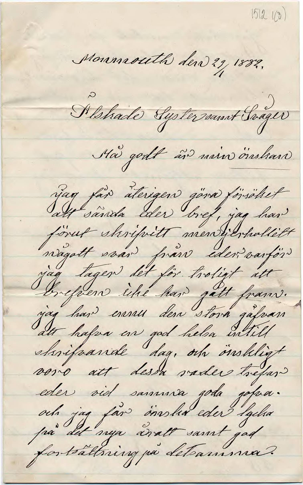

# Quickstart

## Running HTRflow

Once HTRflow is installed, run it with:
```
htrflow pipeline <path/to/pipeline.yaml> <path/to/image>
```
The `pipeline` sub-command tells HTRflow to apply the pipeline defined in `pipeline.yaml` on `image.jpg`. To get started, try the example pipeline in the next section.

## An example pipeline
Here is an example of an HTRflow pipeline:
```yaml title="pipeline.yaml"
steps:
- step: Segmentation
  settings:
    model: yolo
    model_settings:
      model: Riksarkivet/yolov9-lines-within-regions-1
- step: TextRecognition
  settings:
    model: TrOCR
    model_settings:
      model: Riksarkivet/trocr-base-handwritten-hist-swe-2
- step: OrderLines
- step: Export
  settings:
    format: txt
    dest: outputs
```
This pipeline consists of four steps. The `Segmentation` step segments the image into lines. Those lines are transcribed by the `TextRecognition` step and then ordered by reading order by `OrderLines`. The `Export` step exports the result as a text file to a directory called `outputs`.

This pipeline works well for single-column running text such as letters, notes and single pages. Here are some examples to try:

=== "Example 1"
    <figure markdown="span">
    {: style="height:400px;" }
    <figcaption>A moving certificate (sv: "flyttattest") from the 1700s. <a href="https://sok.riksarkivet.se/bildvisning/A0062408_00007">Source</a>. </figcaption>
    </figure>

=== "Example 2"
    <figure markdown="span">
    {: style="height:400px;" }
    <figcaption>A moving certificate (sv: "flyttattest") from the 1700s. <a href="https://sok.riksarkivet.se/bildvisning/A0062408_00006">Source</a>. </figcaption>
    </figure>

=== "Example 3"
    <figure markdown="span">
    {: style="height:400px;" }
    <figcaption>A letter dated 1882. <a href="https://sok.riksarkivet.se/bildvisning/Brev_451511_1512_01">Source</a>. </figcaption>
    </figure>

To run the demo pipeline on your selected image, paste the pipeline content into an empty text file and save it as `pipeline.yaml`. Assuming the input image is called `image.jpg`, run HTRflow with:
```
htrflow pipeline pipeline.yaml image.jpg
```
The first run may take some time because the two models need to be downloaded. The outputs are written as text files to a new directory called `outputs`. Here are the expected results:

=== "Example 1"
    ``` title="image.txt"
    Mästaren med det lofliga hammarsmeds hämbetet bör¬
    römliga Sven Svensson Hjerpe, som med sin hustru rör¬
    bära och dygdesanna Lisa Jansdotter bortflyttrande
    till Lungsundt Sochn; bekoma härifrån följande
    bewis, at mannen är född 1746, hustrun 1754.
    begge i sina Christandoms stycken grundrade och i
    sin lofnad förelgifwande. warit till hittwarden
    sin 25/4 och wid Förhören på behörig tid.
    Carlskoja fyld 21 Sept: 1773. Bengt Forsman
    adj: Past:
    Sundberg
    ```

=== "Example 2"
    ``` title="image.txt"
    Beskedeliga mannen Jöns Håkansson
    Född 1730, som med dess hustru Åhreborn till
    Margreta Andersdotter född 1736 flygge wäl
    Liungsunds församling, kunna i ägge wäl
    Läfft i och utan bok, och förstå sin Christendom
    Förswarligen, hafwa under sitt wistelig af
    här i Församlingen fördt en Christa gång
    larbar wandel, Commarerade sista gång
    d. 21. nästl. dotren Maria är född. 1760.
    Det. Sigrid 1767. Son Anders 1768. Attr
    Philipstad d. 25. Martii 1773.
    And: Levin
    Malborj
    Comminist loci.
    ```

=== "Example 3"
    ``` title="image.txt"
    Monmouth den 29 1882.
    .
    Platskade Syster emot Svåger
    Hå godt är min önskan
    Jag får återigen göra försöket
    att sända eder bref, jag har
    förut skrifvitt men ej erhallett
    någott wår från eder var. varför
    jag tager det för troligt att
    brefven icke har gått fram.
    jag har erinu den stora gåfvan
    att hafva en god helsa intill
    skrifvande dag, och önskligt
    voro att dessa rader trefar
    eder vid samma goda gofva.
    och jag får önska eder lycka
    på det nya åratt samt god
    fortsättning på detsamma.
    ```

🎉 You have successfully created your first HTRflow pipeline!

## Next steps
- Learn more about [pipelines](pipeline.md)
- Check out all [pipeline steps](../reference/pipeline-steps.md)
