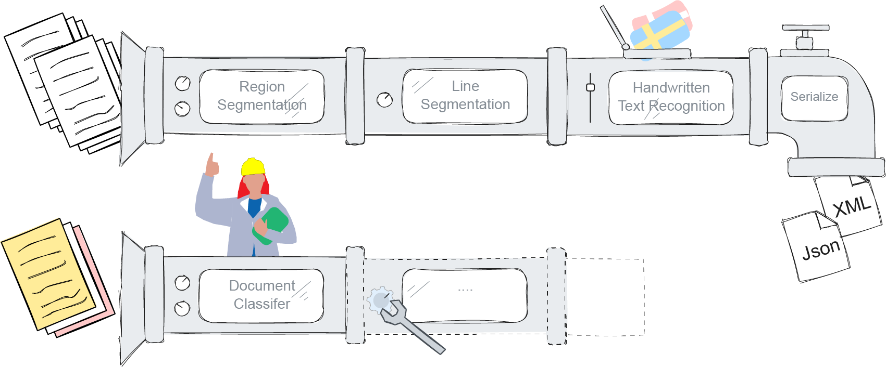

<h1 class="hide-title">Htrflow</h1>

<div align="center"">

</div>


<p align="center">
    
    
    <a href="https://github.com/AI-Riksarkivet/htrflow/actions/workflows/tests.yml">
        
    </a>
    <a href="https://github.com/AI-Riksarkivet/htrflow/actions/workflows/publish-pypi.yml">
        
    </a>
    <a href="https://github.com/AI-Riksarkivet/htrflow/actions/workflows/deploy-docs.yml">
        
    </a>
</p>

___


## HTRflow


HTRflow is an open source tool for HTR and OCR developed by the AI lab at the National Archives of Sweden (*Riksarkivet*).

## Key features

- **Flexibility**: Customize the HTR/OCR process for different kinds of materials.
- **Compatibility**: HTRflow supports all models trained by the AI lab - and more!
- **YAML pipelines**: HTRflow YAML pipelines are easy to create, modify and share.
- **Export**: Export results as Alto XML, Page XML, plain text or JSON.
- **Evaluation**: Compare results from different pipelines with ground truth.

<div align="center"">

</div>


## Installation
Install HTRflow with pip:
```
pip install htrflow
```
For more details, see the [Installation guide](getting_started/installation.md).

## Getting Started


Ready to build your own pipeline for your documents? Head over to the [Quickstart guide](getting_started/quick_start.md) to get started with HTRflow.

The guide will walk you through setting up your first pipeline, utilizing pre-trained models, and seamlessly running HTR/OCR tasks. With the HTRflow CLI, you can quickly set up pipelines using `pipeline.yaml` files as your "blueprints".


